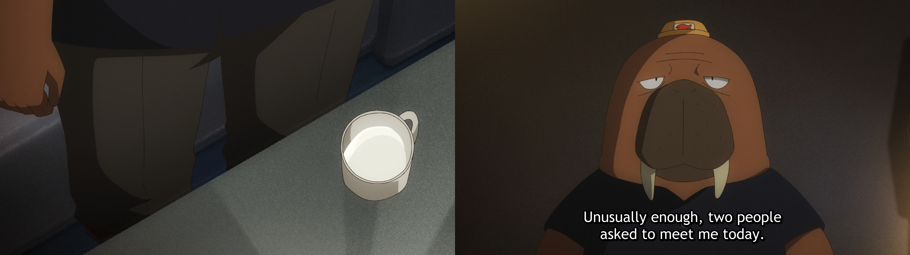

# merge-images

Script to merge images into 1 file

## Usage

```bash
python3 main.py -d <directory> -o <output file>
```

- `-d` or `--directory` is the directory where the images are located. If not specified, the current directory will be used.
- `-o` or `--output` is the output file. If not specified, the output file will be `merged.png`.
- The `pillow` package is required to run this script. Install it with `pip install pillow`.

## Example

```bash
python3 main.py -d example -o oddtaxi-ep5-merged.png
```



Screenshot examples are from the 13th minute of the 5th episode of the anime [Odd Taxi](https://myanimelist.net/anime/46102/Odd_Taxi).
